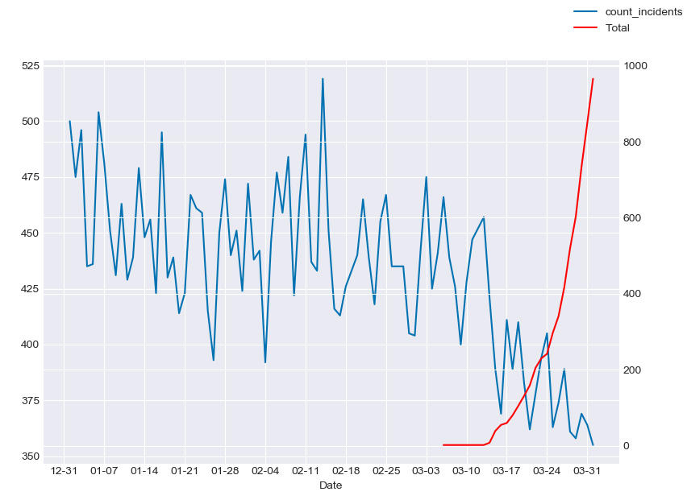
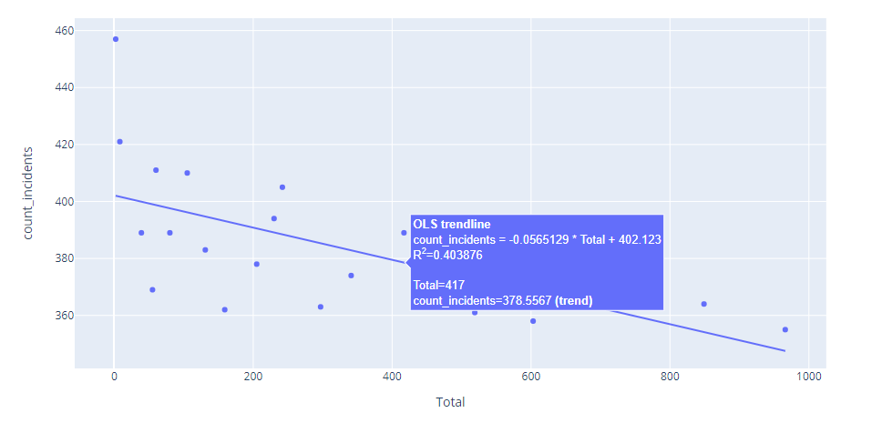

# 2020 San Diego Fire Dept Emergencies vs San Diego COVID-19 Case Counts

## Background

On March 13th 2020 the United States declared a state of emergency regarding the worldwide COVID-19 pandemic. In an effort to chart how the COVID-19 pandemic has affected everyday life, I decided to chart a quick comparison of Fire Department Emergencies in San Diego to the rising COVID-19 case counts in San Diego.

I used a dataset of [2020 reported fire department incidents](https://data.sandiego.gov/datasets/fire-incidents/) as a measure of health-related emergencies in San Diego and a personally daily maintained dataset of confirmed COVID-19 cases by the [San Diego County Local Government](https://www.sandiegocounty.gov/content/sdc/hhsa/programs/phs/community_epidemiology/dc/2019-nCoV/status.html). My dataset can be found in the files in this repo as well as on a [kaggle link](https://www.kaggle.com/idarerick/san-diego-covid19-case-count).

The goal is to determine whether or not there is a correlation between the rising San Diego COVID-19 case counts in 2020 with reported fire-department health emergencies in San Diego. The first visual includes a line graph that shows both the rising case counts of COVID-19 as well as falling number of reported fire department incidents. It is quite apparent that as the numbers rise, we see a significant dip in the reported fire incidents.

The second visual is a scatter regression of collisions vs COVID-19 case counts. As of April 1st, the R2 is 0.403876.

